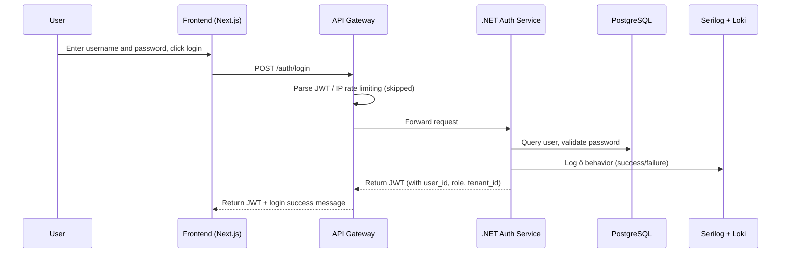
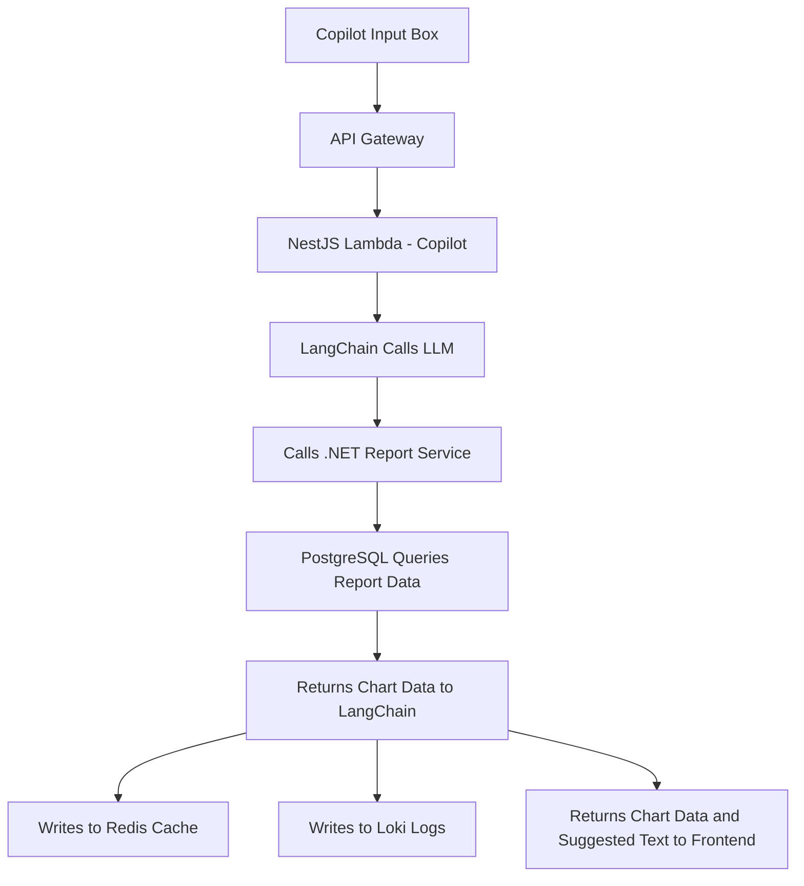
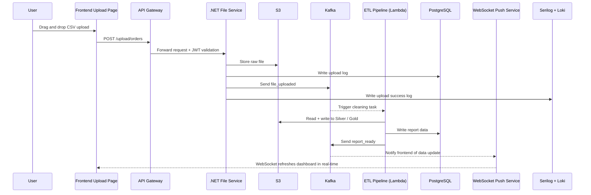
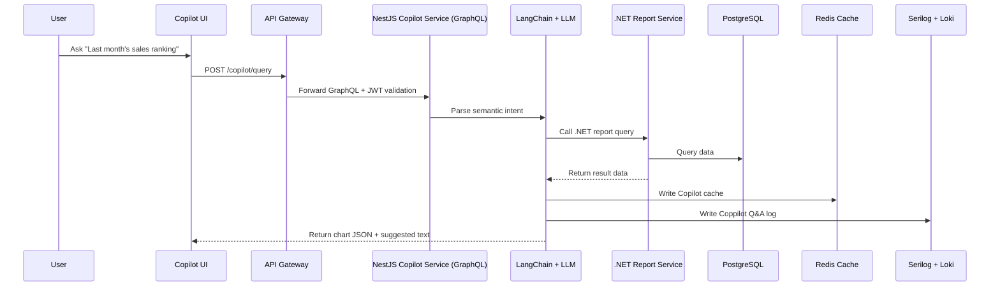

# Data Flow

This document systematically describes the full data flow process under the multi-layer microservice architecture of SmartRetail360, including the general mechanism and the actual data flow paths and flowcharts (Mermaid) for three key business scenarios (login, data upload and report refresh, Copilot intelligent Q&A).

## 1. General Data Flow Mechanism

### 1.1 Request Entry
- Users initiate requests (e.g., login, upload, Q&A) through the frontend UI
- Requests pass through Cloudflare CDN (caching and security protection) and enter the API Gateway
- API Gateway performs:
  - JWT decoding (user identity verification)
  - Rate limiting and blacklist filtering
  - Attaching user attributes to request headers (user_id, role, tenant_id)
  - Routing requests to target services (.NET, NestJS Lambda)

### 1.2 Authentication and Permission Control
- The server validates identity via JWT
- Applies RBAC / ABAC models to control operation permissions (e.g., whether upload or resource access is allowed)
- Permission failures return an error response directly and are logged in the audit log

### 1.3 Service Processing Mechanism
- Microservices extract user context from JWT
- Interact with databases (PostgreSQL / Redis), cache, S3, Weaviate, etc.
- If subsequent processes are needed, publish Kafka events (decoupled processing)

### 1.4 Logging
- Behavioral logs are written to PostgreSQL (e.g., upload, export)
- System logs are written to Loki (for Grafana queries)
- Prometheus collects service expectations (latency, CPU, failure rate)

### 1.5 Asynchronous Triggering
- Kafka event streams connect microservices: ETL, recommendation, model training, etc.
- Services asynchronously consume events like file_uploaded, report_ready

### 1.6 Frontend Feedback Mechanism
- All APIs return a standard format:
```json
{
  "success": true,
  "data": { ... },
  "message": "Operation successful"
}
```
- Error cases:
```json
{
  "success": false,
  "error": {
    "code": "PERMISSION_DENIED",
    "message": "You do not have permission to perform this operation"
  }
}
```
- Real-time updates are notified via WebSocket (Kafka-driven)

## 2. User Login

### 2.1 Sequence Diagram (Mermaid)


### 2.2 Flowchart


## 3. Data Upload

### 3.1 Sequence Diagram


### 3.2 Flowchart


## 4. Copilot Chart Query

### 4.1 Sequence Diagram


### 4.2 Flowchart
