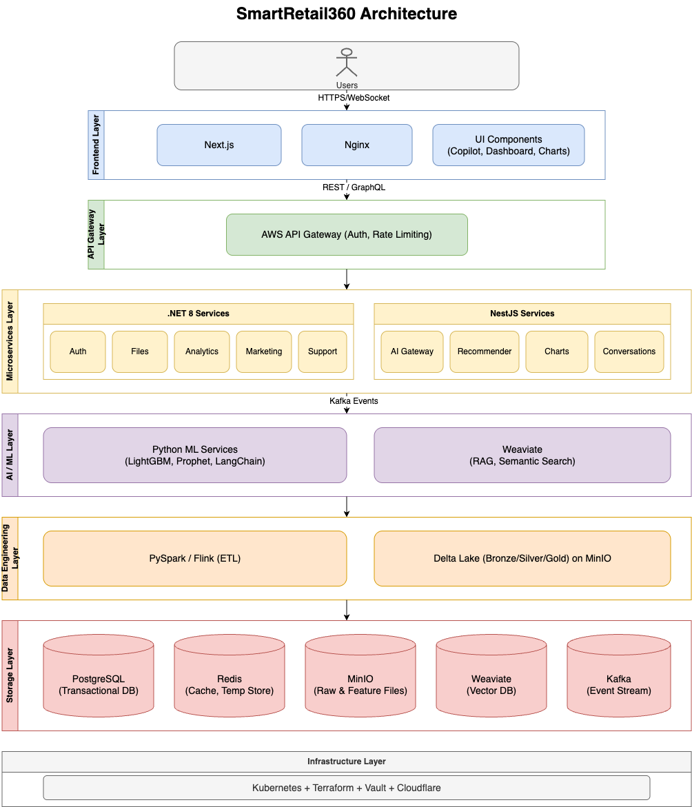

# System Architecture

## 1. Overview

SmartRetail360 is a cloud-native intelligent operations platform designed for small to medium-sized e-commerce businesses, aiming to provide functionalities such as sales data analysis, forecasting, user segmentation, marketing content generation, automated customer service, and personalized recommendations. The system integrates full-stack development (Next.js, .NET, NestJS), data engineering (PySpark, Flink), data science (LightGBM, Prophet), artificial intelligence (LLM, RAG), and database management (PostgreSQL, Redis, AWS S3, Weaviate, Kafka). It supports high concurrency, multi-region deployment, complies with GDPR/CCPA regulations, and offers enterprise-grade scalability and maintainability, meeting FAANG-level standards.

## 2. System Architecture Design

### 2.1 Overall Architecture
SmartRetail360 adopts a layered microservices architecture, combining event-driven (Kafka) and API-driven (REST/GraphQL) designs, deployed on AWS EC2 (Kubernetes) + AWS Lambda infrastructure. The system is divided into the following eight main layers:

1. **Presentation Layer (Frontend Layer)**  
   - **Functionality**: Provides the user interface, including the homepage overview dashboard, AI Copilot operation assistant, intelligent search engine, report download and export, and dynamic dashboard customization, supporting multi-language and real-time updates.  
   - **Technologies**: Next.js, TypeScript, Tailwind CSS, Recharts, Zustand, next-intl, Material UI, react-hook-form, zod, Floating UI, Shepherd.js, Framer Motion, Web Speech API, React Table, Plotly, react-dnd.  
   - **Optimizations**: Utilizes SSR/SSG for performance enhancement, WebSocket for real-time data updates, and Cloudflare CDN for accelerating static resources.

2. **Application Layer (Application Layer)**  
   - **Functionality**: Handles user registration/login/logout, user information modification and password reset, permission configuration, MFA, sales data import, report download and export, login history/activity record viewing, subscription and billing module, AI Copilot operation assistant, recommendation system, dynamic dashboard customization, multi-dimensional cross-analysis, intelligent customer service system, automated marketing content generation, and self-service portal.  
   - **Technologies**: .NET 8 + ASP.NET Core, NestJS, REST/GraphQL, gRPC, Redis, Hangfire, Kafka, Serilog, FluentValidation, ASP.NET Identity, CsvHelper, DinkToPDF, Stripe SDK, AWS SES, Entity Framework Core, Polly.  
   - **Microservices**:  
     - .NET Microservices: User registration/login/logout, user information modification and password reset, permission configuration, MFA, sales data import, report download and export, login history/activity record viewing, subscription and billing module.  
     - NestJS Microservices: Data Gateway, recommendation system, multi-dimensional cross-analysis, dynamic dashboard customization, intelligent customer service system, AI Copilot operation assistant, automated marketing content generation.  
   - **API Gateway**: AWS API Gateway, providing authentication, rate limiting, and version control.

3. **AI Layer (AI Layer)**  
   - **Functionality**: Executes automated marketing content generation, intelligent customer service system, AI Copilot operation assistant, and recommendation system tasks.  
   - **Technologies**: Mistral + LoRA, LangChain, Weaviate (RAG), CLIP, FastAPI, TensorFlow, Faiss, MLflow.  
   - **Optimizations**: Model quantization (INT8), Lambda inference, Redis/Weaviate caching.

4. **Data Science Layer (Data Science Layer)**  
   - **Functionality**: Executes sales forecasting, user segmentation and value assessment, and product funnel conversion analysis tasks.  
   - **Technologies**: Prophet, LightGBM, KMeans, DBSCAN, DoubleML, SHAP, scikit-learn, PyCaret, pandas, matplotlib, H2O, Isolation Forest, Featuretools.  
   - **Optimizations**: MLflow for model tracking, H2O AutoML for efficiency improvement.

5. **Data Engineering Layer (Data Engineering Layer)**  
   - **Functionality**: Handles data ingestion, cleaning, transformation, and storage, supporting sales data import and data cleaning and modeling workflows.  
   - **Technologies**: PySpark, Flink, Delta Lake, Airflow, Dagster, Great Expectations, Apache Atlas, Polars, DuckDB, delta-rs, AWS S3 SDK.  
   - **Process**: Bronze → Silver → Gold data pipeline, supporting incremental updates and Z-Order indexing.

6. **Storage Layer (Storage Layer)**  
   - **Functionality**: Manages and stores relational, cache, object, vector, and event data.  
   - **Technologies**:  
     - PostgreSQL: User data, audit logs, metadata (partitioned tables, GIN indexes).  
     - Redis: Caches hot sales rankings and Copilot responses (cluster mode, TTL).  
     - AWS S3: Data lake and file storage (Z-Order, S3 Glacier).  
     - Weaviate: Vector data (HNSW, S3 backups).  
     - Kafka: Event streaming (multi-partition, Snappy compression).  
   - **Credential Management**: Vault for dynamic rotation.

7. **Infrastructure Layer (Infrastructure Layer)**  
   - **Functionality**: Manages cloud deployment, container orchestration, and monitoring.  
   - **Technologies**: Kubernetes (Helm), Terraform, Pulumi, Grafana, Prometheus, Loki, Cloudflare, AWS Lambda, Istio, LaunchDarkly, Jenkins, GitHub Actions, Docker, AWS ALB, AWS VPC.  
   - **Optimizations**: Multi-region VPC, Istio service mesh, LaunchDarkly for canary releases.

8. **Security & Compliance Layer (Security & Compliance Layer)**  
   - **Functionality**: Handles authentication, authorization, privacy protection, and auditing.  
   - **Technologies**: JWT + OAuth, RBAC, bcrypt, TLS, Vault, AWS Macie, Cloudflare WAF, AWS KMS, FluentValidation.  

### 2.2 Architecture Diagram Validation

### 2.3 Data Flow Design

1. **User Request Initiation**:
   - Users initiate requests via HTTPS (or WebSocket), such as uploading a CSV file through sales data import or querying sales data via the AI Copilot operation assistant.
   - Requests pass through Cloudflare (CDN acceleration and WAF protection) and are forwarded to AWS API Gateway.
   - AWS API Gateway performs JWT validation, rate limiting, and routing, distributing requests to .NET or NestJS services.

2. **Data Ingestion and Processing**:
   - Sales data import requests are handled by .NET, with files stored in AWS S3 (Bronze layer).
   - The .NET service publishes a `file.uploaded` event via Kafka, triggering the data engineering layer (PySpark/Flink).
   - The data engineering layer executes the data cleaning and modeling workflow (Bronze → Silver → Gold), performing cleaning, merging, and feature engineering, then storing the results in AWS S3 (Delta Lake).
   - Data lineage is tracked using Apache Atlas, with tasks scheduled by Airflow/Dagster.

3. **Analysis and AI Processing**:
   - The .NET sales analysis reports and chart display retrieve data from the Gold layer, generating reports and storing them in PostgreSQL.
   - The NestJS Data Gateway receives AI Copilot operation assistant requests, invoking the AI layer (LangChain) for semantic parsing.
   - The AI layer retrieves context using Weaviate (RAG), generating responses or charts, which are cached in Redis.
   - The data science layer (LightGBM, Prophet) performs sales forecasting tasks, with results stored in PostgreSQL or Redis.

4. **Recommendations and Real-Time Updates**:
   - The NestJS recommendation system retrieves vector data from Weaviate, using TensorFlow/Faiss to generate recommendation lists.
   - Kafka triggers recommendation update events, while NestJS handles multi-turn dialogues for the intelligent customer service system, caching responses in Redis.
   - WebSocket pushes real-time updates (e.g., homepage overview dashboard data, recommendation results) to the frontend via Nginx.

5. **Monitoring and Feedback**:
   - All service logs are output via Serilog and stored in Loki.
   - Prometheus collects performance metrics (e.g., API latency, model inference time), with Grafana providing visualization.
   - Anomalies trigger Alertmanager notifications to the operations team.

## 3. Industrial-Grade Best Practices

### 3.1 Scalability
- **Horizontal Scaling**: Kubernetes HPA automatically scales Pods, AWS Lambda scales AI inference on demand, and Redis/Weaviate clusters handle high loads.
- **Precomputation**: Delta Lake materialized views and pre-aggregated hot sales rankings stored in Redis.
- **Real-Time Processing**: Flink achieves sub-second latency, with Kafka multi-partitioning supporting high throughput.

### 3.2 High Availability
- **Multi-Region Deployment**: AWS us-east-1, eu-west-1, ap-southeast-1, with Cloudflare DNS for load balancing.
- **Load Balancing**: AWS ALB + Istio manage traffic, with PostgreSQL multi-node read/write separation.
- **Fault Recovery**: AWS S3 scheduled backups (Glacier cold storage), Weaviate vector data periodic backups.

### 3.3 High Concurrency
- **Load Balancing**: AWS ALB distributes traffic, with Istio service mesh optimizing microservice communication.
- **Caching Optimization**: Redis caches hot data (e.g., hot sales rankings, Copilot responses), with TTL for expiration control.
- **Asynchronous Processing**: Kafka handles peak shaving for ETL, recommendation, and marketing events.
- **Distributed Computing**: PySpark/Flink for distributed ETL, Kubernetes for dynamic scheduling.
- **Rate Limiting and Circuit Breaking**: AWS API Gateway for rate limiting, Polly for circuit breaking and retries.

### 3.4 Security
- **Authentication and Authorization**: JWT + OAuth for user validation, RBAC for permission control, Vault for key management.
- **Data Protection**: bcrypt for password hashing, TLS for transmission encryption, AWS KMS for storage encryption, AWS Macie for privacy compliance.
- **Protection**: Cloudflare WAF for DDoS prevention, FluentValidation for injection defense.

### 3.5 Monitoring and Logging
- **Observability**: Prometheus monitors metrics (API response time, model performance), Grafana for visualization, Loki for log storage.
- **Alerting**: Alertmanager provides real-time anomaly notifications (e.g., database latency, model drift).
- **Auditing**: PostgreSQL stores user behavior logs, Serilog for structured logging.

### 3.6 Deployment and CI/CD
- **Automation**: Terraform/Pulumi for infrastructure management, Jenkins/GitHub Actions for CI/CD.
- **Canary Releases**: LaunchDarkly supports A/B testing and rolling updates.
- **Containerization**: Kubernetes + Helm for deployment consistency, Docker for service packaging.

## 4. Deployment Strategy
- **Infrastructure**: AWS EC2 (Kubernetes) hosts core services, AWS Lambda deploys AI inference.
- **Multi-Region**: Primary region AWS us-east-1, with backups in eu-west-1 and ap-southeast-1.
- **Load Balancing**: AWS ALB + Istio, with Cloudflare CDN for acceleration.
- **Backup**: AWS S3 Glacier for cold storage, PostgreSQL and Weaviate periodically backed up to S3.