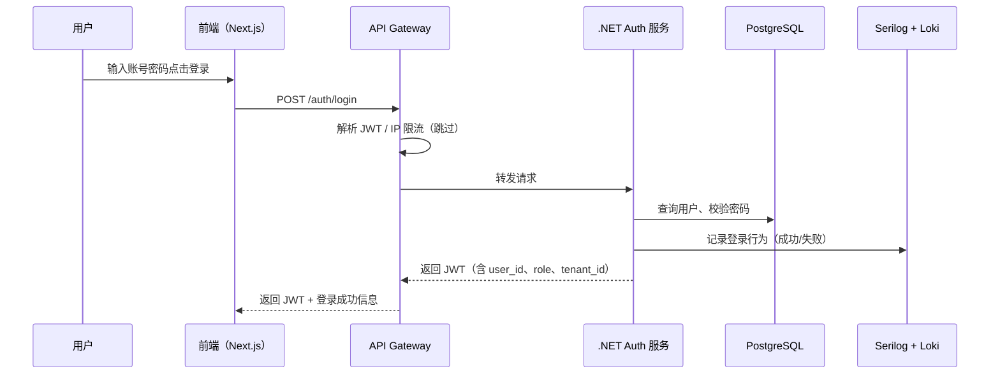
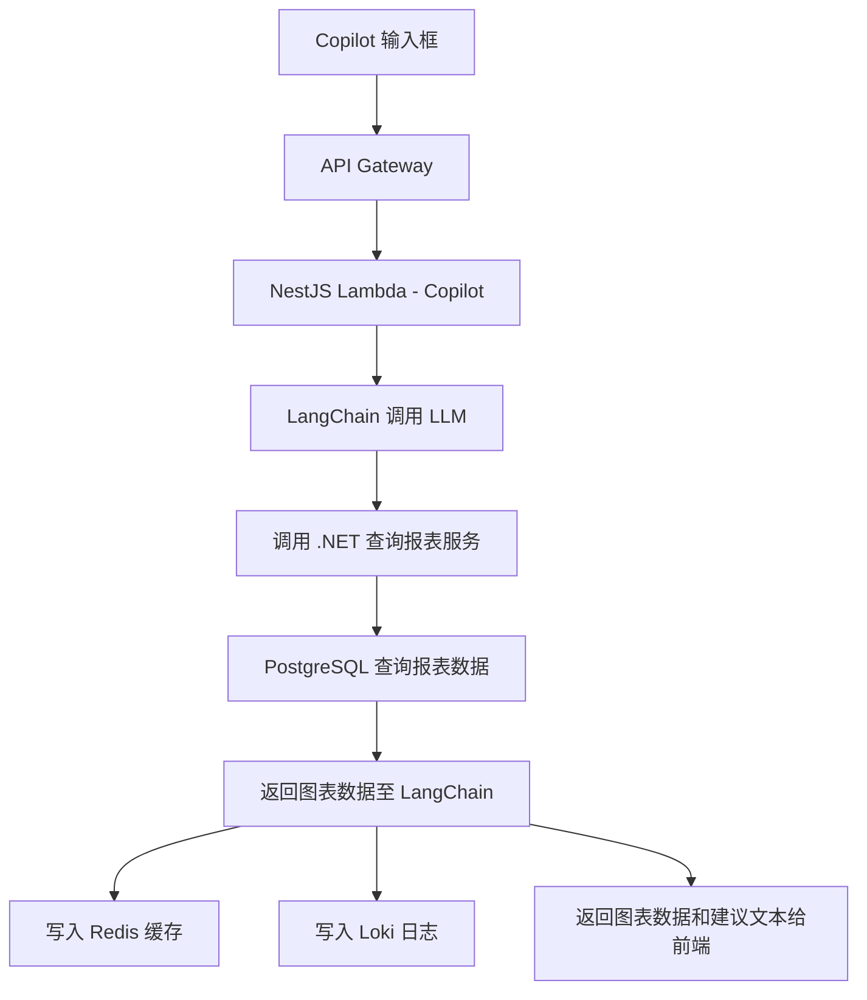
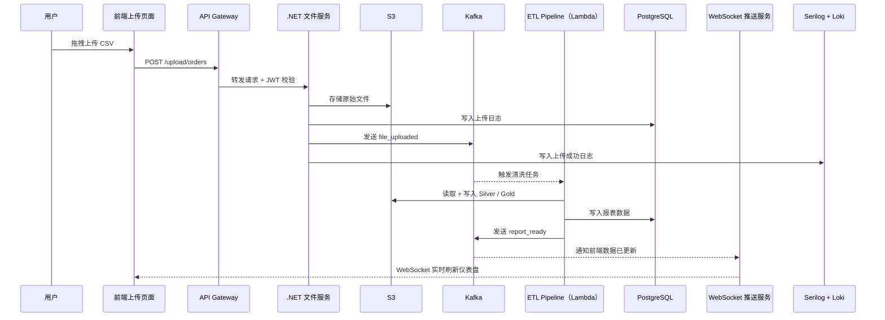
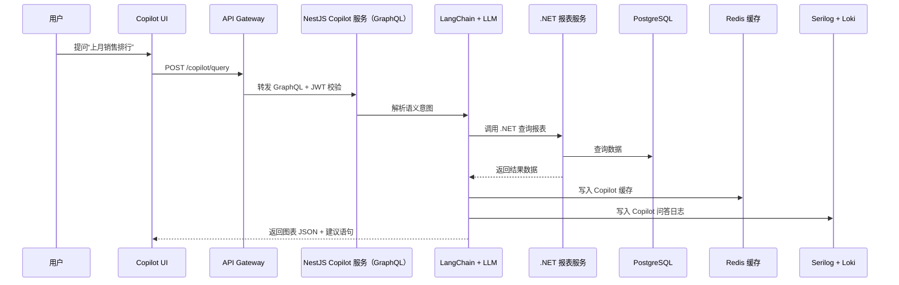

# 数据流

本文件系统性描述 SmartRetail360 多层微服务架构下的全流程数据流，包括总体通用机制，以及三个关键业务场景（登录、数据上传与报表刷新、Copilot 智能问答）的实际数据流转路径和流程图（Mermaid）。

## 一、通用数据流程机制

### 1.1 请求进入
- 用户通过前端 UI 发起请求（如登录、上传、问答）
- 请求经过 Cloudflare CDN（缓存与安全防护），进入 API Gateway
- API Gateway 进行：
  - JWT 解码（验证用户身份）
  - 限流与黑名单过滤
  - 将用户属性附加至请求头（user_id、role、tenant_id）
  - 路由请求到目标服务（.NET、NestJS Lambda）

### 1.2 身份认证与权限控制
 Ascending
- 服务端通过 JWT 完成身份校验
- 启动 RBAC / ABAC 模型，控制操作权限（是否允许上传、访问资源等）
- 权限失败将直接返回错误响应，并写入审计日志

### 1.3 服务处理机制
- 微服务从 JWT 中提取用户上下文
- 调用数据库（PostgreSQL / Redis）、缓存、S3、Weaviate 等
- 若需后续流程，则发布 Kafka 事件（解耦处理）

### 1.4 日志记录
- 行为日志写入 PostgreSQL（如上传、导出等）
- 系统日志写入 Loki（供 Grafana 查询）
- Prometheus 采集服务健康指标（延迟、CPU、失败率）

### 1.5 异步触发
- 通过 Kafka 事件流串联各微服务：ETL、推荐、模型训练等
- 各服务异步消费 file_uploaded, report_ready 等事件

### 1.6 前端反馈机制
- 所有 API 均返回标准格式：
```json
{
  "success": true,
  "data": { ... },
  "message": "操作成功"
}
```
- 错误情况：
```json
{
  "success": false,
  "error": {
    "code": "PERMISSION_DENIED",
    "message": "你没有权限执行此操作"
  }
}
```
- 实时更新通过 WebSocket 通知（Kafka 驱动）

## 二、用户登录

### 2.1 时序图（Mermaid）


### 2.2 流程图


## 三、上传数据

### 3.1 时序图


### 3.2 流程图


## 四、Copilot 查询图表

### 4.1 时序图


### 4.2 流程图
